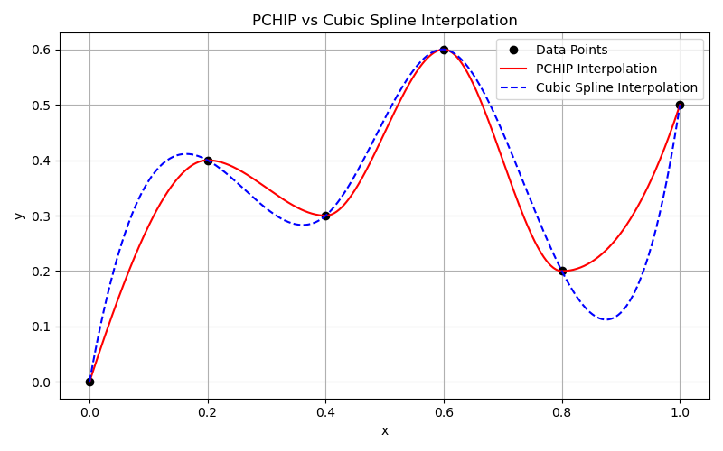

# ParametricNozzleGenerator
## Introduction
A parametric nozzle geometry/meshing tool built using the OpenCascade C++ API and GMSH (.geo) scripting. 

## What it does/How it works?
The program takes a set of inputs (listed in inputs.yaml), the inputs are listed as the following:

Then with the inputs, the program converts the dimensionless coefficients into a Piecewise Cubic Hermite Interpolating Polynomial (PHIP) based spline interpolation algorithm. This specific algorithm was utilized in order to preserve monotonicity and minimize the change for sharp overshoots that would cause issues in mesh generation. 

  

